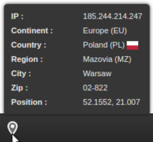

# Geolocation Developer Toolbar

[![Build status][Master image]][Master]
[![Coverage Status][Master coverage image]][Master coverage]
[![Code Climate][Code Climate image]][Code Climate]
[![Packagist][Packagist image]][Packagist]

[![License][License image]][License]


## About
Module providing geolocation toolbar for the [Zend Developer Tools][Zend developer toolbar].




## Dependencies

Install & configure one of the geolocation adapters
- ipstack adapter


## Installation

Install via composer:

```console
$ composer require --dev aist/geolocation-developer-toolbar
```


## TODO

- [ ] Add switching fake locations


  [Zend developer toolbar]: https://codeclimate.com/github/ma-si/geolocation-developer-toolbar
  
  [Master image]: https://img.shields.io/travis/ma-si/geolocation-developer-toolbar/master.svg?style=flat-square
  [Master]: https://secure.travis-ci.org/ma-si/geolocation-developer-toolbar
  [Master coverage image]: https://img.shields.io/coveralls/ma-si/geolocation-developer-toolbar/master.svg?style=flat-square
  [Master coverage]: https://coveralls.io/r/ma-si/geolocation-developer-toolbar?branch=master
  [Code Climate image]: https://img.shields.io/codeclimate/github/ma-si/geolocation-developer-toolbar.svg?style=flat-square
  [Code Climate]: https://codeclimate.com/github/ma-si/geolocation-developer-toolbar
  [Packagist image]: https://img.shields.io/packagist/v/aist/geolocation-developer-toolbar.svg?style=flat-square
  [Packagist]: https://packagist.org/packages/aist/geolocation-developer-toolbar
  [License image]: https://poser.pugx.org/aist/geolocation-developer-toolbar/license?format=flat-square
  [License]: https://opensource.org/licenses/BSD-3-Clause
